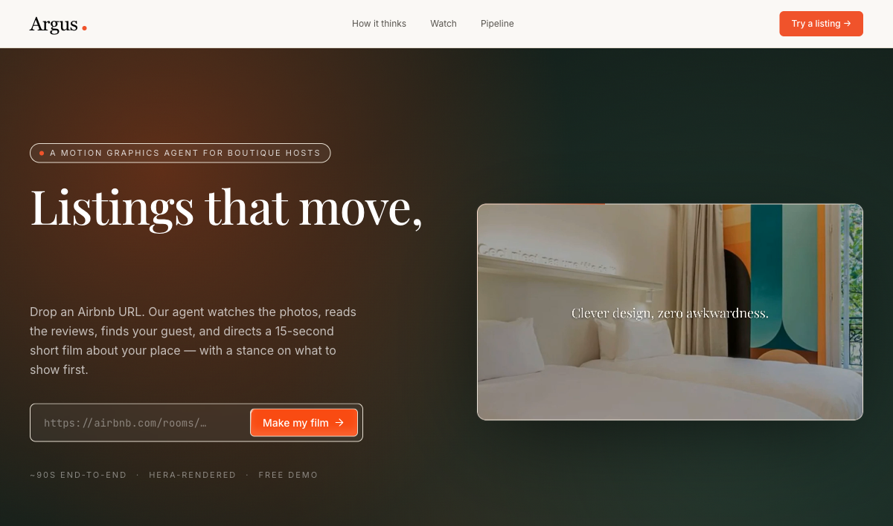
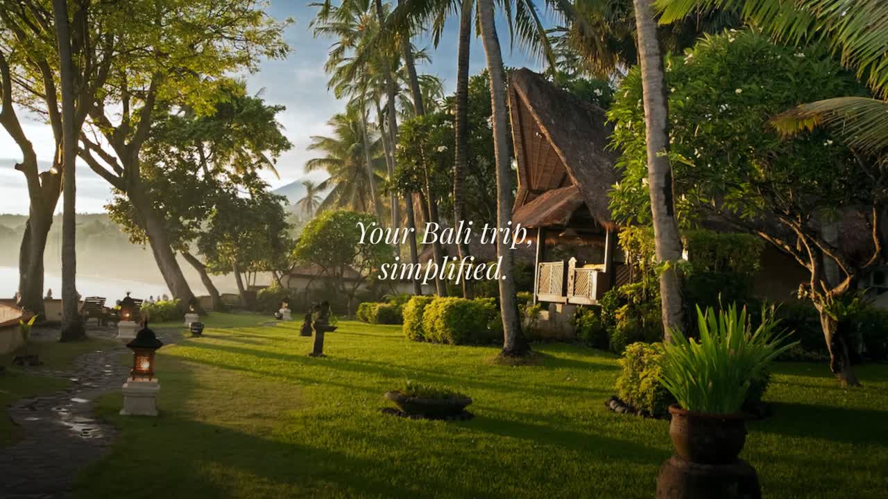
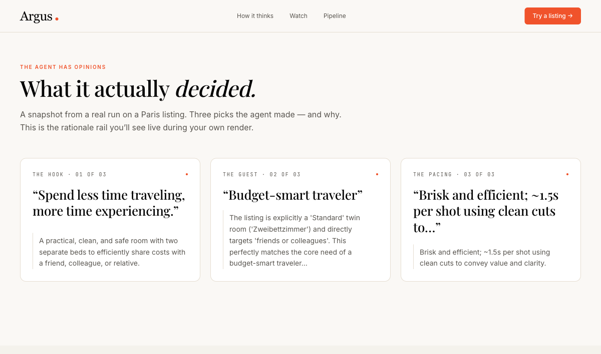
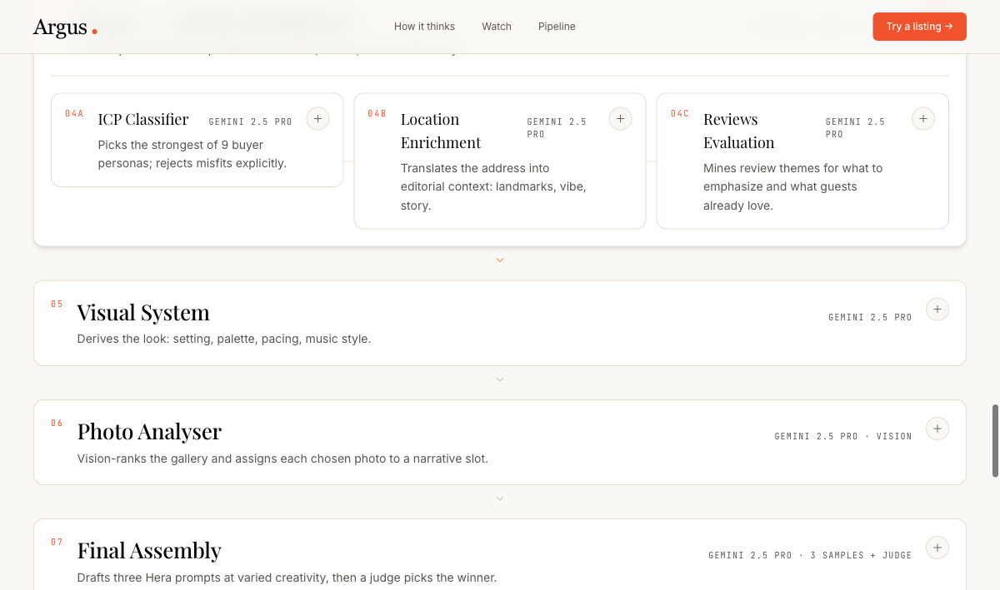
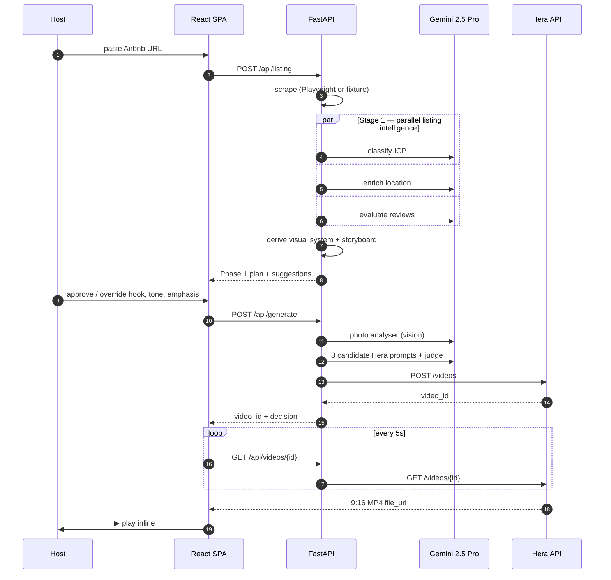
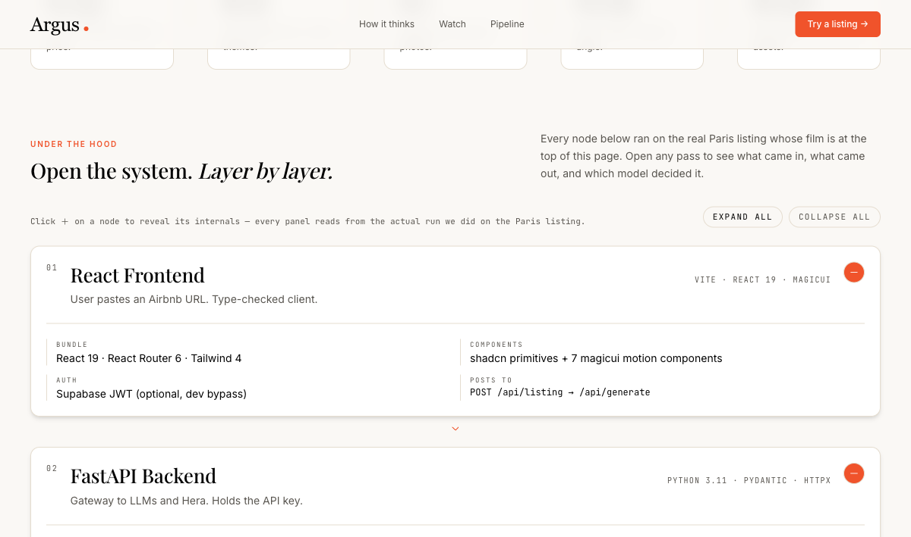

<div align="center">

# Argus *·*

### A motion graphics agent for boutique Airbnb hosts.

**Drop a listing URL. The agent watches the photos, reads the reviews, finds your guest, and directs a 30-second short film about your place — with a stance on what to show first.**

[](https://www.notion.so/karlvillanueva/Berlin-Hackathon-2026-34d942178bfd8059b2ecc0b41790cf44)
[](https://hera.video/?utm_source=luma)
[](#-architecture)
[](#-roadmap)

[ Watch the 60s demo ](#-the-60-second-demo) · [ How it thinks ](#-how-it-thinks) · [ Architecture ](#-architecture) · [ Quickstart ](#-quickstart) · [ Roadmap ](#-roadmap)

</div>

---

## ✦ The premise

Generating a video is easy. Image, video, and language models can spit out an asset in seconds. The hard part is deciding what the asset should look like — the hook, the angle, the pacing, the emphasis. That's what separates work that lands from work that doesn't.

So this isn't a "prompt → video" tool. **Argus is a creative agent with opinions**: a stance on which guest you're really selling to, which photo to lead with, what to leave on the cutting-room floor. Without those opinions, the output is slop.



---

## ▶ The 60-second demo

[](frontend/public/videos/argus-demo.mp4)

> Click the poster to watch the [full 60-second walkthrough](frontend/public/videos/argus-demo.mp4) (`frontend/public/videos/argus-demo.mp4`).

| Time | What happens |
|---|---|
| **00:00** | Paste a real Airbnb URL |
| **00:12** | Agent reads listing, classifies the ICP, picks an angle |
| **00:38** | Render begins on Hera with the assembled prompt + 5 reference photos |
| **00:52** | Final 9:16 short film plays back inline |

---

## ✶ The agent has opinions

Most "AI video" tools jump straight from prompt to pixel. Argus runs **five specialist passes** before a single frame is rendered. Each one forms an opinion the next one inherits — and every decision is surfaced to the host in plain language.



The transparency rail above is rendered live during your own run. Three picks per listing — the hook, the guest, the pacing — each defended in 2-3 sentences the host actually reads.

---

## 🧠 How it thinks

```mermaid
flowchart LR
    URL([Airbnb URL]) --> Scrape
    Scrape -->|listing JSON| Read
    Read   -->|3 parallel agents| See
    See    -->|vision-ranked photos| Decide
    Decide -->|3 candidate prompts<br/>+ judge| Render[Render via Hera]
    Render --> MP4([15-30s 9:16 MP4])

    classDef stage fill:#14201B,stroke:#F94B12,color:#fff,stroke-width:1.5px,rx:8,ry:8;
    classDef io    fill:#F4F2EC,stroke:#2D4A3E,color:#14201B,stroke-width:1.2px,rx:24,ry:24;
    class Scrape,Read,See,Decide,Render stage;
    class URL,MP4 io;
```



| Pass | What it produces | Model |
|---|---|---|
| **01 · Scrape** | Photos, reviews, location, price | Playwright (live) or fixture |
| **02 · Read** | ICP persona · location feel · review themes | Gemini 2.5 Pro × 3 in parallel |
| **03 · See** | Vision-ranked top 5 photos with hero-first ordering | Gemini 2.5 Pro Vision |
| **04 · Decide** | Hook · vibes · pacing · angle · visual system | Gemini 2.5 Pro |
| **05 · Render** | 3 candidate Hera prompts → judge picks the winner | Gemini 2.5 Pro × 3 + judge |

---

## ⚙ Architecture

A two-phase pipeline: **Phase 1** (cheap, ~10s) returns a storyboard the host can approve or override. **Phase 2** (heavy, then Hera ~3min) renders the final film once the host clicks generate.



### Request flow



### Layer breakdown

The host can drill into every pass live in the app. The system is fully introspectable.



| Layer | Tech | Why |
|---|---|---|
| Frontend | Vite · React 19 · Tailwind 4 · shadcn primitives + 7 magicui motion components | Single-screen state machine, no router needed |
| Auth | Supabase JWT (optional, dev bypass) | Hosts can save, resume, publish |
| Backend | FastAPI · Python 3.11 · Pydantic · httpx | Holds `HERA_API_KEY` — never reaches the browser |
| Persistence | Supabase Postgres + RLS | Videos, beliefs, performance snapshots |
| Scraping | Playwright (chromium) + `__NEXT_DATA__` parser, fixture fallback | Survives Airbnb anti-bot in demo |
| Image processing | Nanobanana outpaint to 9:16 (toggle, parallel ×5) | Avoid center-cropping landscape hero shots |
| Reasoning | Vertex AI · Gemini 2.5 Pro (ADC, no API key) | One classifier call per agent, structured JSON |
| Video render | Hera REST `https://api.hera.video/v1` | Source-of-truth for the final MP4 |
| Distribution | YouTube Data API v3 (resumable upload) | One click to publish as a Short |
| Performance loop | Cron-driven snapshot poll → belief confidence updates | Phase 3: the agent learns what's working |

---

## 📁 Repo layout

```text
backend/
  src/
    main.py                  FastAPI app · Hera proxy · YouTube · dashboard
    auth.py                  Supabase JWT verifier (with dev bypass)
    supabase_client.py       Service-role client (never logged)
    youtube.py               OAuth + resumable Shorts upload
    belief_evolution.py      Snapshots → confidence deltas
    agent/
      orchestrator.py        Phase 1 + Phase 2 pipeline
      icp_classifier.py      Persona pick (1 of 9), with rejections
      location_enrichment.py Landmark + walkability narrative
      reviews_evaluation.py  What to emphasise / what to hide / honest quotes
      visual_systems.py      Setting · palette · pacing · music
      photo_analyser.py      Vision rank + narrative slot assignment
      final_assembly.py      3 candidate prompts → judge pick
      outpainter.py          Nanobanana 9:16 (parallel ×5)
      scraper.py             Playwright (live) + fixture fallback
      models.py              Pydantic contracts
frontend/
  src/
    pages/                   Landing · AgentApp · Login · Dashboard
    components/
      landing/               Hero · Opinions · Watch · Pipeline · CtaSection
      ui/magic/              7 motion components (border-beam, ripple, …)
    api/client.ts            Type-checked against backend Pydantic
    types.ts                 TS mirror of AgentDecision + friends
    router.tsx               File-based routing
  public/
    videos/                  argus-hero · argus-demo · poster JPGs
    agent/                   Real AgentDecision JSONs (Paris, Berlin)
architecture/                Single source of truth for the system design
HERA.md                      Local copy of the Hera API/MCP docs
```

---

## 🚀 Quickstart

```bash
# 1. Clone and configure
cp .env.example .env       # paste HERA_API_KEY (https://app.hera.video) + GCP_PROJECT
                           # backend talks to Vertex AI via ADC:
                           # gcloud auth application-default login

# 2. Install deps
make install               # backend (uv sync) + frontend (bun install)

# 3. Run dev servers
make dev                   # FastAPI :8000 + Vite :5173
```

Open <http://localhost:5173> and paste any Airbnb URL with a fixture (`backend/src/agent/fixtures/`) — or set `ENABLE_LIVE_SCRAPE=true` in `.env` to scrape live listings via Playwright.

### Make targets

| Command | What it does |
|---|---|
| `make install` | `uv sync` (backend) + `bun install` (frontend) |
| `make dev` | Run both servers in parallel |
| `make dev-backend` | FastAPI on `:8000` |
| `make dev-frontend` | Vite on `:5173` |
| `make lint` | `ruff check` + `tsc --noEmit` |
| `make format` | `ruff format` + Prettier |
| `make clean` | Remove `.venv`, `node_modules`, build output, logs |

---

## 🔌 API surface

The backend is a thin opinionated orchestrator. The Hera key lives only on the server.

| Method | Path | Purpose |
|---|---|---|
| `POST` | `/api/listing` | Scrape + Phase 1 storyboard (returns instantly, ~10s LLM) |
| `POST` | `/api/generate` | Phase 2 photo analyser + final assembly + Hera submit |
| `POST` | `/api/regenerate` | Re-submit existing decision for a fresh render |
| `GET`  | `/api/videos/{id}` | Hera status passthrough (5s polling) |
| `POST` | `/api/videos/{id}/publish` | Push MP4 to the user's YouTube channel |
| `POST` | `/api/videos/{id}/metrics/refresh` | Pull view/like/comment counts |
| `GET`  | `/api/dashboard` | Per-user video grid + aggregate stats |
| `GET`  | `/api/videos/{id}/timeseries` | All snapshots, oldest → newest |
| `GET`  | `/api/beliefs/evolution` | Show how performance data updates the agent's rules |
| `GET`  | `/api/youtube/connect-url` | Start the Google OAuth flow |
| `GET`  | `/api/health` | `{ ok, hera_key_loaded }` smoke test |

Full request/response shapes live in [architecture/02-architecture.md](architecture/02-architecture.md).

---

## 🗺 Roadmap

| Phase | State | What's in it |
|---|---|---|
| **Phase 1 — MVP** | ✅ Shipped | Single-screen flow · fixture-backed · classifier → Hera → poll |
| **Phase 2 — Storyboard + persistence** | ✅ Shipped | 6-agent pipeline · ICP/location/reviews/visual/photo/judge · Supabase · regenerate · download · outpaint toggle · Playwright scraper · auth · YouTube auto-publish · performance dashboard |
| **Phase 3 — The learning loop** | 🚧 In progress | Cron-driven snapshot poll → belief confidence drift · multi-platform (Booking.com, VRBO) · IG/TikTok publishing · belief-by-belief A/B |

The full design lives in [architecture/02-architecture.md](architecture/02-architecture.md), [architecture/03-agent-pipeline.md](architecture/03-agent-pipeline.md), and [architecture/01-ui-flow.md](architecture/01-ui-flow.md).

---

## 📚 References

- **Hera** — API docs: <https://docs.hera.video/api-reference/introduction> · MCP: <https://docs.hera.video/mcp-server> · App: <https://app.hera.video/>
- **Local Hera mirror** — [HERA.md](HERA.md) (full endpoints, schemas, agent levers)
- **Hackathon plan** — [Notion](https://www.notion.so/karlvillanueva/Berlin-Hackathon-2026-34d942178bfd8059b2ecc0b41790cf44?source=copy_link)
- **System design** — [architecture/](architecture/)

---

<div align="center">

Built in 24h for the **Berlin Tech Europe Hackathon 2026**, **Hera track** · *AI Agents for Video Generation*.

*The video is the proof — the reasoning is the product.*

</div>
