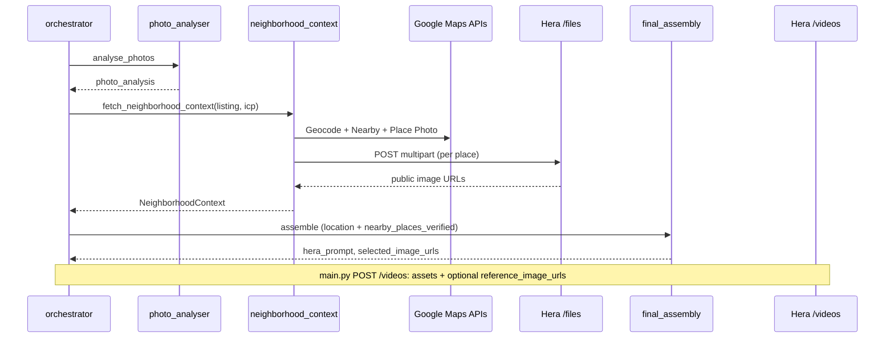

# Neighborhood context — Google Places + Hera

This document is the **architecture addendum** for the optional “nearby attractions” path: real POIs around the listing, persona-tuned place types, official Place Photos, and Hera-hosted reference URLs for motion graphics.

**Code:** `backend/src/agent/neighborhood_context.py`  
**Wiring:** `backend/src/agent/orchestrator.py` (Phase 2 render), `backend/src/agent/final_assembly.py` (prompt contract), `backend/src/main.py` (`reference_image_urls` on create video).

---

## Why it exists

- **Conversion:** SCENE 2 (location / context) can show **named nearby venues** with real imagery instead of only abstract copy from the LLM location agent.
- **Truthfulness:** POI names and distances come from **Google Maps Platform APIs**, not scraped HTML.
- **Hera constraints:** Google photo URLs are often redirects; Hera needs stable fetchable URLs. We **download** Place Photos and **upload** each to `POST https://api.hera.video/v1/files`, then pass returned URLs as `reference_image_urls`.

---

## Environment

| Variable | Required | Role |
|---|---|---|
| `GOOGLE_PLACES_API_KEY` or `GOOGLE_MAPS_API_KEY` | For this feature | Geocoding, Nearby Search, Place Photo |
| `HERA_API_KEY` | Always (for uploads + render) | Hosts place JPEGs via `/files` |

Google Cloud project must have **Geocoding API** and **Places API** enabled, billing on, and key restrictions compatible with **server-side** calls (not browser referrer–only keys).

---

## When it runs

Only during **`run_render_from_plan`** (after photo analysis, before strategic final assembly):

1. Geocode `"{listing.title}, {listing.location}"`.
2. For the **ICP persona**, pick up to four [Nearby Search table-1 types](https://developers.google.com/maps/documentation/places/web-service/supported_types) (e.g. Digital nomad → `cafe`, `library`, `park`, `tourist_attraction`).
3. Merge results by `place_id`, rank by rating × log(review volume) / distance.
4. Take up to **three** places that have a `photo_reference`.
5. Download JPEG via Place Photo API; upload each to Hera `/files`.
6. Inject **`nearby_places_verified`** into the location payload passed to **final assembly** (mirrored in the Gemini user JSON as **`NEIGHBORHOOD_GOOGLE_PLACES`**).

**Failure behavior:** Any missing key, HTTP error, or empty result → **empty context**; pipeline continues with listing-only assets (no user-visible error).

---

## Hera request shape

Unchanged for listing photos:

- **`assets`:** up to five **listing** images (`selected_image_urls`).

Additive when neighborhood succeeded:

- **`reference_image_urls`:** up to three **Hera file URLs** for nearby venues (max five per Hera cap; we cap at three).

**Outpainting** applies only to `selected_image_urls`, never to neighborhood references.

---

## Agent contract (Strategic Opinion / final assembly)

- **`PROPERTY_PHOTOS` / `reference_photo_indices`:** listing shots only.
- **`NEIGHBORHOOD_GOOGLE_PLACES`:** rows with `name`, `distance_m`, `types`, `rating`, `hera_reference_url`, optional Google attributions. System prompt instructs: use for **lifestyle / SCENE 2 cutaways**; never label as interior listing photography.

---

## Persistence and API contract

- **`AgentDecision`** carries `neighborhood_reference_urls` and `neighborhood_places` for UI (`RationaleRail`) and for **`POST /api/regenerate`** to resubmit the same references.
- **`Phase1Decision`** intentionally has **no** neighborhood block (keeps storyboard fast and avoids extra Google quota on preview).

---

## Diagram (Phase 2 render path excerpt)

---

## Operational notes

- **Cost:** Geocoding + N× Nearby + M× Place Photo + M× Hera upload per render; cache by `(address_hash, persona)` if volume grows.
- **Attributions:** Place Photos may require **Google attribution** in consumer-facing surfaces; `neighborhood_places[].google_photo_attributions` is stored for compliance-minded UI.
- **Rotation:** Treat Maps API keys as secrets; never commit `.env`.

---

## Suggested future extensions (not implemented)

1. **Phase 1 preview:** optional lightweight `/api/listing` neighborhood **names only** (no Hera upload) for storyboard chips — trades quota for UX.
2. **Places API (New):** migrate off legacy Nearby/Photo endpoints when the team standardizes on the new surface.
3. **Caching layer:** Redis or Supabase row keyed by `lat,lng` rounded to ~200 m + persona slug.
4. **OSM fallback:** zero-Google path for demos using Overpass + Wikimedia (different license/UX tradeoffs).
